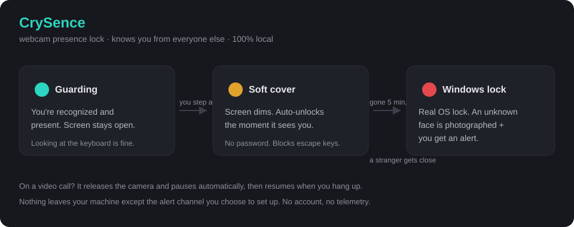
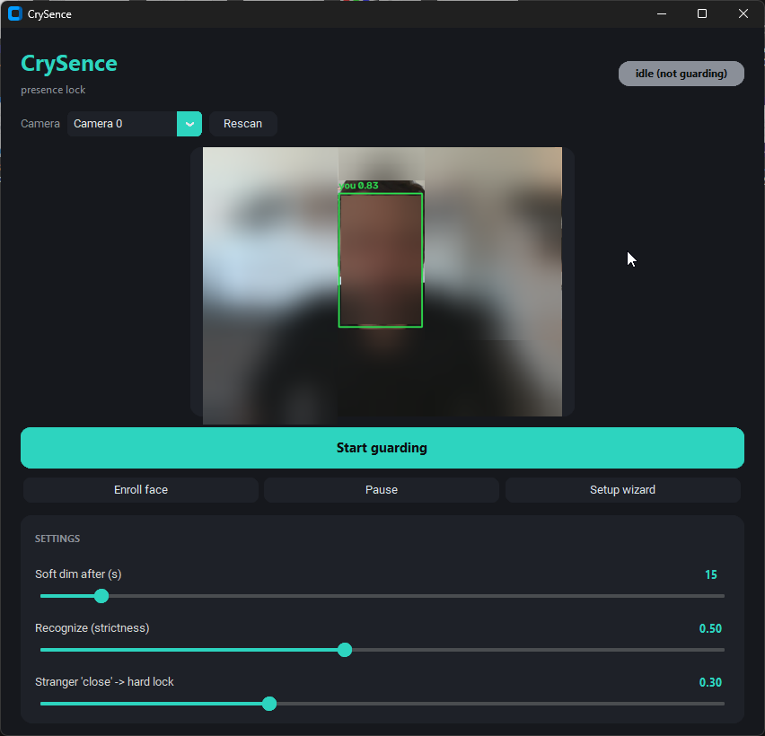

# CrySence

[](https://github.com/crymetr/crysence/releases/latest)
[](LICENSE)


**A webcam presence lock for Windows that knows _you_ from everyone else.** It
locks when you walk away, recognizes your face to bring you back, and if an
unknown face gets close to your screen it captures a photo and alerts you. It
gets out of the way for video calls. Everything runs **locally** — no cloud, no
account, no telemetry.



## Screenshots



_The main window recognizing its owner — the green box and match score
(`You 0.83`) mean it knows you. Also here: the camera picker, live preview, and
the strictness sliders. (Face blurred on purpose.) Setup wizard, soft cover, and
tray shots — plus a short clip of the cover lifting itself — coming next (recipe
in [`docs/DEMO.md`](docs/DEMO.md))._

## Why

An idle-timer lock is dumb: it fires while you're reading and stays open while
you're gone. CrySence locks on **presence**, not a timer — and because it knows
your face, it can dim softly and let _you_ back in without a password, while
still hard-locking for anyone else.

## Features

| | |
|---|---|
| 🧠 **Knows your face** | Enroll once (OpenCV YuNet detection + SFace recognition, local ONNX models). It tells you apart from anyone else and lets only you back in. |
| 🛡️ **Layered locking** | A soft cover drops when you step away and lifts itself the moment it recognizes you, no password. A stranger close to the screen, or a long absence, triggers a real Windows lock. |
| 📸 **Intruder capture + alert** | An unknown face close to your screen is photographed and clipped locally, with an alert through whatever channel you enabled (Windows toast + optional email / push). |
| 🎥 **Meeting-aware** | When another app uses your mic or webcam (Teams, Zoom, a browser call), CrySence releases the camera and pauses, then resumes when the call ends. Muting mid-call won't yank the camera back. |
| ⌨️ **Keyboard-glance safe** | Looking down at your keyboard reads as "still you," so it won't lock in your face. |
| ♻️ **Auto-updates** | The installer keeps itself current from GitHub Releases — the only outbound call you didn't configure yourself. |

## Privacy first

This watches your webcam, so trust matters. CrySence is built to be auditable:

- **100% local.** Face detection, recognition, and captures never leave your
  machine.
- **No telemetry, no account, no network calls** — except the one update check
  to GitHub and the alert channel _you_ choose to configure. That's it, and you
  can read every one of them in [`crysence/notify.py`](crysence/notify.py) and
  [`crysence/updater.py`](crysence/updater.py).
- Your face is stored only as a **numeric embedding** (`owner_face.npy`), never
  as images.
- No secrets in this repo. All config lives under `%LOCALAPPDATA%\CrySence\`.

Don't trust a binary that watches your camera? **Run it from source** (below) and
read the ~1k lines yourself.

## Install

### Run from source (recommended if you want to read it first)
```
git clone https://github.com/crymetr/crysence
cd crysence
python -m pip install opencv-python-headless numpy pillow winotify pystray customtkinter
python -m crysence
```
A tray icon appears; a first-run wizard walks you through camera, face
enrollment, lock mode, and (optional) alerts.

### Installer
Grab `CrySence-Setup-x.y.z.exe` from the
[latest release](https://github.com/crymetr/crysence/releases/latest). It's a
per-user install (no admin) and auto-updates itself from future releases.

> It isn't code-signed, so SmartScreen will warn ("unknown publisher"). Right
> click the file → **Properties → Unblock → OK**, then run it. Or just run from
> source above.

## Settings (tune in the window, saved to `config.json`)

| Setting | Meaning | Default |
|---|---|---|
| Soft dim after (s) | Seconds not present before a soft cover | 15 |
| Recognize | Match strictness to count as "you" | 0.50 |
| Stranger close (hard lock) | How big a stranger's face means "at your screen" | 0.30 |
| Layered | Soft cover first, then hard lock (off = Windows lock only) | on |

## Alerts

Windows toast is always on. To also get notified when you're away, enable a
channel in the wizard or in `%LOCALAPPDATA%\CrySence\config.json`
([`config.example.json`](config.example.json) shows the shape):

- **ntfy** — simplest: pick an unguessable topic, subscribe on your phone. No account.
- **SMTP email** — any provider (Gmail needs an App Password).
- **Telegram** — a bot token + chat id.
- **Resend** — if you have a verified domain + API key.

Only fill in what you use. Nothing is sent anywhere you didn't set up.

## Known limitations

Honest edges — a tool that watches your camera shouldn't hide them:

- The **soft cover is privacy, not security** — it can be killed via
  Ctrl+Alt+Del → Task Manager, which no user-mode app can block. The **hard
  Windows lock** is the real thing.
- **No liveness detection yet.** Recognition is 2D, so a good printed photo of
  you could satisfy it. Treat CrySence as a convenience + privacy tool, not
  defense against a determined, prepared attacker. (Liveness is on the roadmap.)
- **Windows only.** Recognition accuracy depends on your webcam and lighting —
  the strictness slider is there for a reason.

## Roadmap

- [ ] **Activity log** — a local timeline of lock / unlock and intruder events
  you can scroll back through, so you can see who came and went while you were
  away even if you never set up an alert channel.
- [ ] Liveness / anti-spoof (so a photo can't pass)
- [ ] Code signing (drop the SmartScreen warning)
- [ ] Per-app "always allow this face" for a shared desk
- [ ] Linux and macOS support

## Changelog

### v0.2.1 — 2026-08-20
- **Fixed:** no more false lock when the webcam briefly sleeps under USB power management.

### v0.2.0 — 2026-08-19
- **Added:** self-update straight from GitHub Releases (per-user, no admin).
- **Added:** packaging — PyInstaller build, per-user Inno Setup installer, portable install, and a GitHub Actions release workflow.
- **Changed:** hardened after an internal security review.

### v0.1.0 — 2026-08-19
- Initial release: local webcam presence lock with owner recognition, layered
  soft/hard lock, meeting-aware pause, and pluggable alerts.
- Modern CustomTkinter GUI with a first-run setup wizard.

## More projects

Poke around the rest of what I build at **[cryme.tr](https://cryme.tr)**.

## Credits

Face models from the [OpenCV Zoo](https://github.com/opencv/opencv_zoo):
YuNet (detection) and SFace (recognition).

## License

MIT — see [LICENSE](LICENSE).
